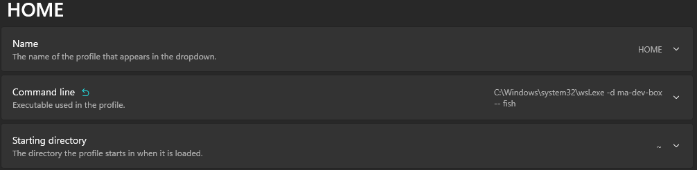

# pictet local stack

Spin a local pictet development environement quickly and with simple steps.

### Preview

|make|idea|
| -- | -- |
|||

|postman|daemons|
| -- | -- |
|  |  |

### State

PRODUCT :
- [x] a
- [x] b
- [x] c
- [x] d
- [x] e
- [x] f
- [x] g
- [x] h
- [x] i

### 1. Requirements

- Copy our WSL configuration within an admin powershell to get a better stability with mutliple services.

```ps1
"[wsl2] `nmemory=18GB `nswap=8GB `nkernelCommandLine = `"sysctl.vm.swappiness=10`" `n[experimental] `nautoMemoryReclaim=gradual"  | Out-File  -Encoding ascii $Env:USERPROFILE\.wslconfig
```

- Install and configure Ubuntu 24.04 LTS WSL2 distribution from [Microsoft Store](https://apps.microsoft.com/detail/9nz3klhxdjp5?hl=fr-FR&gl=CH).

- A little `wsl --update` and a restart with `wsl --shutdown ma-dev-box` if you already have it set up.

- Then enter in WSL machine over [Windows Terminal](https://www.microsoft.com/fr-fr/p/windows-terminal/9n0dx20hk701)

To finish checks, inside /etc/wsl.conf, you have to ensure the **presence of following lines** :

```ini
[boot]
systemd=true
```

If it's not present, then apply changes by doing a **restart of your WSL shell** with `wsl --shutdown ma-dev-box`.

### 2. Shell, Nix and direnv

- **fish** recommended shell for better compatibility with Makefile shortcuts.

- **Nix** is a declarative package manager that enables users to declare the desired system state in configuration files (declarative configuration), and it takes responsibility for achieving that state.

- **direnv** is an extension for your shell. It augments existing shells with a new feature that can load and unload environment variables depending on the current directory.

#### Install nix and direnv :

```bash
sudo apt install -y direnv;
sh <(curl -L https://nixos.org/nix/install) --daemon;
```

##### Or Upgrade it if you already have an installation :

**IN sudo** :

```bash
nix-channel --update; nix-env --install --attr nixpkgs.nix nixpkgs.cacert;
systemctl daemon-reload; systemctl restart nix-daemon
```

#### (Optional) Install and configure fish :

```bash
sudo apt-add-repository -y ppa:fish-shell/release-3
sudo apt update -y && sudo apt upgrade -y
sudo apt install -y fish
curl -fSsL https://git.pictet.com/lroux/pictet-local-stack/-/raw/develop/config.fish -o ~/.config/fish/config.fish
```

Finally we have to configure the **profile** for this shell in **Windows Terminal** like the following image :



And then **open a new terminal with this profile**.

#### Configure ZSH :

```bash
echo 'eval "$(direnv hook zsh)"' >> ~/.zshrc
```

> **Warn:** Ensure ~/.zshrc or ~/.bashrc do not provide anything related to sdkman or nvm.

> Then restart your shell : `exec $SHELL`

##### [For Other shells](https://direnv.net/docs/hook.html)

#### Initialize nix workspace :

```bash
cd ~; git clone https://git.kazan.mypictet.com/lroux/pictet-local-stack
```

In home folder, install the base shell.nix and allow direnv to operate, the process takes around 10 minutes to **download all dependencies** :

```bash
cp ~/pictet-local-stack/shell.nix . && cp ~/pictet-local-stack/.envrc .
direnv allow .
```

Then you will be prompted user and a token from artifactory, **please move to next step to get them**.

## 3. Repositories configurations

#### Before starting

Your kazan user **id** and **token** **from [/#user/usertoken](https://git.pictet.com/#user/usertoken)** will be asked during **direnv and nix initialisation**. it will be stored in `~/.config/.nexus-user` and `~/.config/.nexus-token`.

> The page **could be initialy forbidden**, try multiple refresh and move to another page like account to be able to see it.


And take the **user token name** and **token pass code** to fill the prompt.

#### Git UI rights

**Warning** : Before starting any git commands, check your trusted ssh keys in remotes gitlab, copy it with `cat ~/.ssh/id_ed25519.pub | pbcopy`

> If you dont have one do `ssh-keygen -t ed25519 -C 'email@pictet.com'`

- [Bitbucket SSH keys](https://git.pictet.com/-/profile/keys)
- [Github SSH keys](https://github.com/-/profile/keys)

If you get issues with forbidden access, you can try a ssh-add with the original generated WSL ssh key.

```bash
eval $(ssh-agent -s)
```

or for fish `eval (ssh-agent -c)`.

#### Projects rights

Then you have to ask for access to [kazan](https://pictet.com/portal/#/) projects :

### 4. Copy files in your meta folder

```bash
cd pictet-prefix-meta
```

```bash
cp ~/pictet-local-stack/pictet/shell.nix . && cp ~/pictet-local-stack/pictet/.envrc .
direnv allow .
```

> For older **jdk 8** move `semeru-bin` version in shell.nix to `unstable.semeru-bin-8`. Other versions can be found in [nixpkgs](https://search.nixos.org/packages?channel=unstable&from=0&size=50&sort=relevance&type=packages&query=semeru-bin).

#### Notes on upgrading pictet-local-stack

- For Later, to be able to **upgrade your shell and services configuration** with new nix dependencies, you have to run :

```bash
rm -rf .venv; direnv reload
```

This will always gather latest pictet-local-stack version files.

**Warn** : The nix cache has a notabme time to live so if you want a recent commit/update of the configurations you have to delete the cache with :

```bash
rm -rf ~/.cache/nix
```

Then you can do `direnv reload` to get the new configuration.

#### Other things to do when upgrading

- Upgrading git related repos :Check GIT_CLONE_REPOS variable in .env and go in folders to do `git pull --rebase` to get the latest version of your repositories.

- Upgrade meta repositories : `meta git pull --rebase` or do `meta update`.

- Ensure the checkout of the correct branch in your meta repositories.

- Do a `make install` to get all the latest dependencies.

- Or also try `make INCLUDE='pictet-..*(your_project)|pictetcust-..(your_cust_project)' mvn-install` to get the latest dependencies of choosen projects.

- **IMPORTANT** : Mind to do `cp .cnf/.env.<your_project> .env` to get the correct updated configuration for your project
> But save your old .env file before if you have made customizations.

- If you're on a really old version of pictet-local-stack, you can do a `git pull origin develop --rebase` in your cloned pictet-local-stack folder and restart the step **step 4. Copy files in your meta folder** from the beginning.

#### Going back to an older version

If you want to go back to an older version of pictet-local-stack, you can do and edit of `shell.nix` like this :

```nix
  envs = (import (builtins.fetchTarball {
    url = "https://gitlab.kazan.myworldline.com/W116770/ti-local-stack/-/archive/<commit-hash>/ti-local-stack-<commit-hash>.tar.gz";
  }) { inherit pkgs; });
```

Here an example commit to back off onto if you need legacy zuul and eureka : `98bd7dd840e18053b25297a50b0a5d15b3651a5b`

### 5. Maven and npm install

**Using nix, settings.xml is automaticly generated with your DAS/SSHPASS credentials.**

> **Warn**: If you have old code in `~/.m2/repository` related to other java version than the one configured for your project, it's better to delete the folder sometimes.

Then you can do :

```bash
make install
```

> Unfortunately, sometimes you can get a stuck on a `yarn install` command, so skip it for now and you'll have to delete yarn.lock in the front end project(s) root(s) and retry `yarn install` inside it.

Also after fixing **potential authentication with kazan/ssh or yarn issues** , run the command `make repo-clone mvn-install-product mvn-install ARGS=-U`

**Mind that ARGS=-U force maven to update all dependencies.**

#### Notes on make install

**make install** is a combination of multiple other make targets :

- `install-misc` for certicates and hostnames configurations
- `repo-clone` for the git repositories required like configmap and product ones.
- `make mvn-install` for your project java services maven install
- `make web-install` for front end projects yarn install

### 6. First services initialization

Before continuing, you have to start a service pre-defined stack :

> **Note** : Every daemons (mysql, kafka, elasticsearch, cassandra) are implicitly started with `make daemons` under the hood.

**Light stack for only adviser and admin management operations**

```bash
make light

make log-light
```

**Stats**

```bash
make stats

make log-stats
```

**Full** (customer + adviser)

```bash
make full

make log-full
```

Then do **`make status`** to see if services are in a good state.

> **Note :** You can add args to maven commands started in make with `ARGS`. For example `make ti-service-toto/ti-toto-service ARGS=-U`

> **Note :** Also you can use `SHORTCUT_GOAL=start-all-services` to avoid starting web and svc-mesh again.

### 7. Databases

#### Importing data

You have to pull data of following databases tables to get a working environment. Also don't forget to start required services one time before running any import command.

Multiple helper scripts are here to help you retrieve a database table (**only for a network accessible database**) :

**make pull-table** to retrieve an entire table in a single shot :

```bash
REMOTE_MYSQL_PASSWORD='pass$$' make pull-table 1=pictet-actors 2=table_name
```

> **Note** once you're here you should have enough, next commands are for more specific advanced usages.

**dump-sql :**

```bash
REMOTE_MYSQL_PASSWORD=pass make dump-sql 1=pictet-actors 2=table_name > pictet-actors.table_name.sql
```

To run a sql script do **make run-sql** command :

```bash
make run-sql 1=pictet-actors 2=dump/pictet-actors.table_name.sql
```

> **Warning** : if you have a $ in password you have to double it like this `Password123$$`.

#### Once you retrieved every required tables, your application will be ready to use.

#### Other import helper scripts

Usage can be made by `make ./script`.

#### Credentials

**S3 on localhost:9900 with minio**

- admin User : adminClientUser / adminClientPassword
- App user : testClientKey / testClientSecret
- ISO sandbox user : check in .env AWS_ACCESS_KEY_ID and AWS_SECRET_ACCESS_KEY

**MySQL on localhost:3306**

- root : root / root
- ti app user : ti / ti

**Kafka on localhost:9092**
- No credentials

**Elastic Search on localhost:9200**
- No credentials

### 8. Idea IntelliJ

#### Idea Launch and Debug

> `make install` implicitly generate idea run configuration for all services. If you want to generate them manually, you can do it with :

```bash
make idea-configs
```

> Note: This command behaviour depends on .env file configurations

Inside `.run/` folder of any project, a run configuration xml file will be available. Juste double click on it if you don't see it appears on top right corner of your IDE.

#### Idea Plugins

For database we recommends plugins : `Database Navigator`, `Database Tools and SQL` and `Big Data Tools`.

### 9. VScode

#### VScode Launch and Debug

> `make vscode-configs` was done in `make install`, It will generate launch.json files for all services.

Then you can use vscode debug tab to start any service or attach its to any running java process.

> Note: `Attach mode` in java project is only available when make commands are started with a defined variable `JDEBUG=true`.

> Note: web ui is not available in attach mode.

#### Vscode Extensions

Install **recommended extensions** by typing @recommended in `Extensions` Tab.

You will get :

- **Database client** which is pre-configured with all required databases
- Nix and direnv support
- Java & Spring support
- Javascript and ember support
- Shell scripting and YAML langage support

#### Vscode generate workspace

All :

```bash
make generate-vscode-workspace
```

Only some service to save memory :

```bash
make INCLUDE='ti-..*(stat|event)' generate-vscode-workspace
```

```bash
make INCLUDE='ti-..*(interco)|ticust-..*(conversation|routing)' generate-vscode-workspace
```

### 10. Postman setup

**Warn** This needs the enablement of swagger dependencies in your spring project. But, by default it is not, so this module would not work on every project without a pom file change.

Better to ask your colleagues for postman collections.

Start `make INCLUDE='ti-..*(...)' all -j2` with services you want in postman from a terminal and then :

```bash
make fetch-api-docs
```

Then import collections in postman : `Import > Select Folders > Choose ~/Postman`

For automatic API authentication with **ti-service-authentication**, add to request **authentication/user/login** the following script in **Tests** tab :

```js
postman.setEnvironmentVariable("apiKey", JSON.parse(responseBody).token);
```

Other way but need to know fully qualifier Ip / port address

```js
postman.setEnvironmentVariable("apiKey", pm.response.headers.all()
    .find(v => v.key.toLowerCase() == "set-cookie")
    .value.split(";")[0].split("tiAuthToken=")[1]
)
```

Finally fill your credentials in body, select environment "Ti Local" and run login request.

### 11. Proxies

##### Mitmproxy (automaticly started).

> Note: tested on browser and micro services.

To start mitmproxy run `make mitmproxy` (alias for `mitmweb --listen-port=5555 &`)

- [UI](http://127.0.0.1:8081/)
- Http Proxy : http://127.0.0.1:5555 : `PROXY_PORT=5555` inside `.env` trigger activation for java services.

To be able to dump network of front end apps :

- Install [Proxy Switchy Omega](https://chrome.google.com/webstore/detail/proxy-switchyomega/padekgcemlokbadohgkifijomclgjgif)
- Setup a proxy on `localhost:5555` (You could ignore chrome healthchecks url like `google.com,youtube.com,googleapis.com`)
- Go to [http://mitm.it](http://mitm.it) with new proxy enabled on it
- Install certificate on your machine for windows.

### 12. Advanced Daemon tools usage

Daemons are docker related to essential stack tools like mysql, kafka.

Docker services are pre seeded by default so you don't need additional setup to create elastic indexes and cassandra keyspaces.

Select docker services to use with `COMPOSE_PROFILES` variable in .env file.
By default it's `COMPOSE_PROFILES=all` with cassandra, kafka, mysql, elasticsearch, zookeeper and s3.

Start :

```bash
make daemons
```

Stop :

```bash
make daemons-stop
```

> `make daemons-restart` is also available

> **Note** you can pass args to docker compose command with `make daemons 1=--build`.

#### Docker Compose useful commands

Only start kafka, elasticsearch and mysql with :

```bash
make daemons 1='kafka elasticsearch mysql'
```

Sometimes you have to delete databases to restart from scratch or update a elastic template and cassandra schema. For that you can delete volumes of running containers with :

```bash
docker compose down elasticsearch --volumes
```

### 13. Make Services advanced usage

Start a specific service with (use tab after make command for completion if your shell support it) :

```bash
make abc-service/service-abc
```

Multiple services :

```bash
make abc-service/service-abc azr-service/service-azr -j2
```

#### State commands

You can also kill services with :
- `make kill-all-services`
- `make kill.<your full service folder>`

You can also restart services with :
- `make restart.<your full service folder>`

Then you can log with :
- `make log-all-services` for all started services
- `make log.<your full service folder>` for a single service

### 14. Combined usage

Also there is a system by using following enumeration :

1. `make all` for daemons + services mesh

2. Daemons, services mesh and chosen services.

```bash
make JDEBUG= INCLUDE='..*(abc|efg)' all -j2
```

> JDEBUG= should be used for many cases where the port has a wrong value configured. You could start service with a debug server with `make ./service-svc/svc-service` syntax later.

3. use `-j3` to also start web UI

#### Other useful commands :

- Log only useful services :

```bash
make INCLUDE='..*(abc|efg)' log-all-services
```

## 16. Github cli

Create a personal access token with :

- [For Ingenico](https://gitlab.global.ingenico.com/-/user_settings/personal_access_tokens)
- [For Kazan](https://gitlab.kazan.myworldline.com/-/user_settings/personal_access_tokens)

> The minimum **required scopes** are 'api' and 'write_repository'.

After, choose **token** sign in, **SSH** as git protocol and **HTTPS** as Api protocol.

```bash
gh auth login --hostname git.pictet.com
gh auth login --hostname github.com
```

##### Useful gh commands :

Create a repo :

```bash
gh repo create shell-scripts
```

Open repo in your browser

```bash
gh repo view --web

```

Create an MR with target branch and draft state.

```bash
gh pr create -t ':bug: handle default entity edge cases' -b develop --draft
```

View MR for your current branch.

```bash
glab pr view

```

Here, the full [usage manual](https://cli.github.com/manual/).

## 17. Troubleshoot

#### Missing jks file for kafka

```bash
make install-misc
```

#### Port already started

```
ss -ltunp 'sport = :8017'
```

Gather pid and then do `kill pid`

#### Npm install failing on direnv reload

```bash
npm cache clean -f
```

#### *`error: cannot connect to socket at '/nix/var/nix/daemon-socket/socket': Connection refused`*

Try a `sudo systemctl restart nix-daemon`

If you're still struggling, you can ensure systemd is enabled within WSL2 :

```bash
echo -e '[boot]\nsystemd=true' >> /etc/wsl.conf
```

Then start a powershell as admin and run :

```ps1
wsl --shutdown ma-dev-box
```

And reopen a WSL shell tab.

#### mvn install giving `Failed to execute goal com.github.alexcojocaru:elasticsearch-maven-plugin:6.27:runforked (start-elasticsearch)`

**Don't use `mvn install`** but go within your meta folder and run `make install.ti-your-service`

You can still use the command filtering only on working maven lifecycle phases :

```bash
mvn -fn clean plugin:descriptor resources:resources generate-sources \
  compiler:compile jar:jar plugin:addPluginArtifactMetadata install:install
```

#### 401 on maven repositories

1. Case of your token has been reset

Update it to you latest token in `~/.config/.artifactory-token` and maybe `~/.config/.artifactory-user`

2. Case of settings.xml with unauthorized repositories :

Inside ~/.m2/settings.xml, remove repositories and mirrors you don't have access to.
Your project ones should be enough.

Example of xml blocks you have to remove for each project you don't have access granted :

> Note : it's better to juste ask for all project access to your manager.

```xml
<repository>
  <id>data-pictet-maven-group</id>
  <url>https://artifactory.pictet.com/repository/data-pictet-maven-group</url>
</repository>

<mirror>
  <mirrorOf>*,!fpl-pictet-maven-group</mirrorOf>
  <url>https://artifactory.pictet.com/repository/other-pictet-maven-group</url>
  <id>other-pictet-maven-group</id>
</mirror>

```

#### `no space left` during maven install

Temporary partition is too small, you can increase it with :

```bash
sudo mount -o remount,size=5G /run/
```

or if no error maybe `sudo mount -o remount,size=5G /run/user/1000`

#### *`java unamed module (ex java.util not found) error during build`*

Retry make install :

```bash
rm -rf ~/.m2/repository
make mvn-install
```

#### x509: certificate signed by unknown authority during `docker pull`

```bash
true | openssl s_client -connect registry-scl-staging.pictet.com:443 2>/dev/null | openssl x509 -out /tmp/registry-scl-staging.crt
sudo mkdir -p /etc/docker/certs.d/registry-scl-staging.pictet.com
sudo cp /tmp/registry-scl-staging.crt /etc/docker/certs.d/registry-scl-staging.pictet.com/ca.crt
sudo systemctl restart docker
```

For `registry.pictet.com` :

```bash
true | openssl s_client -connect registry.pictet.com:443 2>/dev/null | openssl x509 -out /tmp/registry.crt
sudo mkdir -p /etc/docker/certs.d/registry.pictet.com
sudo cp /tmp/registry.crt /etc/docker/certs.d/registry.pictet.com/ca-prod.crt
sudo systemctl restart docker
```

For `https://git.kazan-mw.pictet.com` :

```bash
true | openssl s_client -connect git.pictet.com:443 2>/dev/null | openssl x509 -out /tmp/git-pictet.crt
```

Also use :

```bash
sudo cp -f /tmp/*.crt /usr/local/share/ca-certificates/
sudo update-ca-certificates
```

Retry `make daemons` after that.

#### **Actor heap space error**

Delete entries inside profile_external_permissions and profile_permissions tables.

```sql
DELETE FROM profile_external_permissions where company != '87800';
DELETE FROM profile_permissions where company != '87800';

```

##### Unable to start actor - Liquibase error

First of all, truncate actor database.

Do a `make daemons` with folowing lines in .env to move mySql to version 5.7 :

```bash
MYSQL_VERSION=5.7
MYSQL_CNF=my-57.cnf
```

Start actor and wait for it to be fully started.

Then do `make daemons` with original .env content and restart actor :

```bash
MYSQL_VERSION=8.0.39
MYSQL_CNF=my-80.cnf
```

This should fix the issue.

#### Zuul service not starting : *`Could not create SyslogWriter java.net.UnknownHostException: syslogHost_IS_UNDEFINED: Name or service not known`*

1. Move to systemd boot :

`echo -e '[boot]\nsystemd=true' >> /etc/wsl.conf` and restart wsl with command above.

2. Or use rsyslog container

In .env edit variables below to configure rsyslog :

```
COMPOSE_PROFILES=all,rsyslog
SHARED_SPRING_ARGS=-Dlogger.syslog.host=localhost
```

Check the correct behaviour of youre make install command you have probably issue cloning repositories and you should check yours ssh keys on gitlab ingenico and kazan.

- https://git.pictet.com/-/profile/keys
- https://pictet.github.com/-/profile/keys

#### Unable to login / Conection refused to 127.0.0.1:5555

It's probably a lack of access to the middleware proxy mitm, just start it with :

```bash
nohup mitmweb --listen-port=5555 &
```

#### **Virtualbox conflict**

Virtualbox and WSL2 are not compatible, you have to keep virtualbox shut down. when using WSL.

"WSL2 is not supported with your current machine configuration" after enabling Hyper-V, Virtual Machine Platform, Windows Subsystem for Linux, Hypervisor Platform and virtualization in up-to-date bios.

- `bcdedit /set hypervisorlaunchtype off`

- `bcdedit /set hypervisorlaunchtype auto`

and after restarting the machine, Wsl2 will work.
